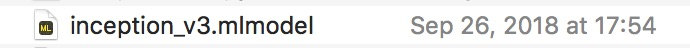
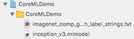
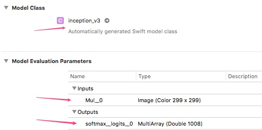
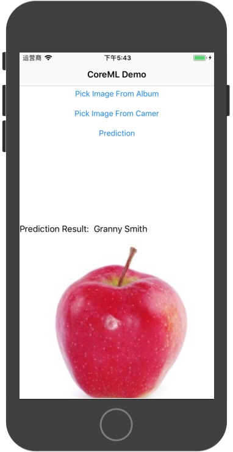

---

title: 在 iOS 设备上运行 TensorFlow 中训练好的模型
subtitle: zisbsyxtfm
date: 2018-09-28 17:46:31
tags: iOS, TensorFlow, CoreML, Vision
mathjax: true

---

<!-- 在 iOS 设备上运行 TensorFlow 中训练好的模型 -->

有2种方法可以在 iOS 设备上运行训练好的模型:

1. 导入 TensorFlow 的 iOS 版 `TensorFlow-experimental`, 然后在工程中使用 TensorFLow 的 C++ 版来实现.
2. 将模型转换成 `CoreML` 所支持的格式 `*.mlmodel`, 然后使用` CoreML`框架实现.

需要注意的是, 两个方法都需要使用 `.pb` 格式的模型. 

来先说说`方法 1: 使用 TensorFlow-experimental`

## 方法1: 使用 TensorFlow-experimental 加载模型

具体方法就不说了, 参见 [TensorFlow-example-iOS](https://github.com/tensorflow/tensorflow/tree/master/tensorflow/examples/ios). 运行项目前记得读 `README.md`, 主要就是说要先 `pod install/update` 一下, 然后再下载需要的模型文件到 `demo 项目的 data 目录下`


这里有几个坑, 就是 `很多方法和 python 版的不同, 有的直接没有`.因为 `TensorFlow-experimental` 为了更好的适配移动端, 对 PC 版进行了一定阉割.

导致我在使用 `Inception-v3` 模型来测试的时候, 报了一个 `DecodeJpeg` 相关的错误

```objc
Could not create TensorFlow Graph: Invalid argument: No OpKernel was registered to support Op 'DecodeJpeg' with these attrs.  Registered devices: [CPU], Registered kernels:
  <no registered kernels>

	 [[Node: DecodeJpeg = DecodeJpeg[acceptable_fraction=1, channels=3, dct_method="", fancy_upscaling=true, ratio=1, try_recover_truncated=false](DecodeJpeg/contents)]]
```

原因是内核没有注册`DecodeJpeg opertation`, 模型的计算图中有使用此方法, 故加载失败.

所以这里可以使用 [GitHub - tfcoreml](https://github.com/tf-coreml/tf-coreml) 对模型进行处理.

处理过程是这样的:

首先, 加载并打印`inception-v3`的计算图:

```python
# Load the TF graph definition
tf_model_path = './tensorflow_inception_graph.pb'
with open(tf_model_path, 'rb') as f:
    serialized = f.read()
tf.reset_default_graph()
original_gdef = tf.GraphDef()
original_gdef.ParseFromString(serialized)

# For demonstration purpose we show the first 15 ops the TF model
with tf.Graph().as_default() as g:
    tf.import_graph_def(original_gdef, name='')
    ops = g.get_operations()
    for i in range(15):
        print('op id {} : op name: {}, op type: "{}"'.format(str(i),ops[i].name, ops[i].type));
>>>
op id 0 : op name: DecodeJpeg/contents, op type: "Const"
op id 1 : op name: DecodeJpeg, op type: "DecodeJpeg"
op id 2 : op name: Cast, op type: "Cast"
op id 3 : op name: ExpandDims/dim, op type: "Const"
op id 4 : op name: ExpandDims, op type: "ExpandDims"
op id 5 : op name: ResizeBilinear/size, op type: "Const"
op id 6 : op name: ResizeBilinear, op type: "ResizeBilinear"
op id 7 : op name: Sub/y, op type: "Const"
op id 8 : op name: Sub, op type: "Sub"
op id 9 : op name: Mul/y, op type: "Const"
op id 10 : op name: Mul, op type: "Mul"
op id 11 : op name: conv/conv2d_params, op type: "Const"
op id 12 : op name: conv/Conv2D, op type: "Conv2D"
op id 13 : op name: conv/batchnorm/beta, op type: "Const"
op id 14 : op name: conv/batchnorm/gamma, op type: "Const"
```

看输出结果可以发现, 原始模型的输入是一个 `jpeg` 的`contents`, 开始对其进行了预处理. 这里作者直接把预处理去掉了, 把入口直接设置在了 `op id 9`这个位置, 即`Mul`操作

全部方法参见 Demo. 修改之后的模型, 入口参数变成了 `[1, 299, 299, 3]`的矩阵, 输出不变.

使用修改后的模型重试...

wht ??
居然又出错了了, 错误信息:

```objc
Executor failed to create kernel. Invalid argument: NodeDef mentions attr 'dilations' not in Op<name=Conv2D;
```

原来是编译生成模型的版本和运行的版本不一致造成的, pod 上的版本是 `1.1.1`,
PC上的是 `1.10.1`. 一些后来添加的新方法, 如 `dilations` op 在手机上就没有.  

最后, 如果你的计算图用的操作都比较基础可以考虑使用`pod TensorFlow-experimental`方法部署, 否则请尝试`方法2` 或 根据 github 上的说明 `自行编译静态库`.

## 方法2 转换模型并使用 CoreML 部署

根据官方文档 [Converting Trained Models to Core ML | Apple Developer Documentation](https://developer.apple.com/documentation/coreml/converting_trained_models_to_core_ml?language=objc)

可以使用工具来转换训练好的模型.

这里我使用 [GitHub - tf-coreml](https://github.com/tf-coreml/tf-coreml)

具体使用方法`github文档` 写的很清楚了.

然后, 生成转换好的模型(figure-1)



把转换好的 `inception_v3.mlmodel` 导入 `iOS项目`:



点击 `inception_v3.mlmodel` 可以查看到 model 的详情:



可以看到一些信息:

* Xcode 自动生成了一个与模型对应的类 `inception_v3`
* 入口参数 `Mul__0`,输入`299x299`的 Image, 这个是转换的时候自己命名的
* 输出变量 `softmax__logits__0`, 也是转换的时候自己命名

点击 `inception_v3` 右边的小箭头查看类文件, 可以看见其类型是 `CVPixelBuffer` 和 `prediction`方法.

```swift
...
var Mul__0: CVPixelBuffer
...
func prediction(Mul__0: CVPixelBuffer) throws -> inception_v3Output {
        let input_ = inception_v3Input(Mul__0: Mul__0)
        return try self.prediction(input: input_)
    }
...

```

调用方法已经知道了, 现在需要把` Image` 转换成`CVPixelBuffer`

```swift
func resizeImage(image: UIImage,with size: CGSize) -> UIImage {
        UIGraphicsBeginImageContextWithOptions(size, false, UIScreen.main.scale)
        image.draw(in: CGRect(x: 0, y: 0, width: size.width, height: size.height))
        let resizedImage: UIImage = UIGraphicsGetImageFromCurrentImageContext()!
        UIGraphicsEndImageContext()
        return resizedImage
    }
```

```swift
let inputImage = resizeImage(image: image!, with: CGSize(width: 299, height: 299))

let pixelBufferAttr = [kCVPixelBufferCGImageCompatibilityKey: kCFBooleanTrue,
                               kCVPixelBufferCGBitmapContextCompatibilityKey: kCFBooleanTrue] as CFDictionary
        
var pixelBuffer : CVPixelBuffer?
let status = CVPixelBufferCreate(kCFAllocatorDefault, 299, 299, kCVPixelFormatType_32ARGB, pixelBufferAttr, &pixelBuffer)
guard (status == kCVReturnSuccess) else {
    print("转换CVPixelBuffer失败!")
    return
}

CVPixelBufferLockBaseAddress(pixelBuffer!, CVPixelBufferLockFlags(rawValue: 0))
let pixelData = CVPixelBufferGetBaseAddress(pixelBuffer!)

let rgbColorSpace = CGColorSpaceCreateDeviceRGB()
let context = CGContext(data: pixelData, width: Int(inputImage.size.width), height: Int(inputImage.size.height), bitsPerComponent: 8, bytesPerRow: CVPixelBufferGetBytesPerRow(pixelBuffer!), space: rgbColorSpace, bitmapInfo: CGImageAlphaInfo.noneSkipFirst.rawValue)

context?.translateBy(x: 0, y: inputImage.size.height)
context?.scaleBy(x: 1.0, y: -1.0)

UIGraphicsPushContext(context!)
inputImage.draw(in: CGRect(x: 0, y: 0, width: inputImage.size.width, height: inputImage.size.height))
UIGraphicsPopContext()
CVPixelBufferUnlockBaseAddress(pixelBuffer!, CVPixelBufferLockFlags(rawValue: 0))
```

#### 使用 CoreML 进行预测

附上关键部分代码来体现处理逻辑:

```swift
let image = loadImage()
let myModel = inception_v3()
var pixelBuffer = converToBuffer(image)
let result: inception_v3Output = try myModel.prediction(Mul__0: pixelBuffer!) as inception_v3Output

// result 就是输出结果 

var min: Float = 0
var index = -1

for i in 0..<result.softmax__logits__0.count {
    if result.softmax__logits__0[i].floatValue > min {
        min = result.softmax__logits__0[i].floatValue
        index = i
    }
}
print("result.softmax__logits__0.count=", result.softmax__logits__0.count)
// index 即为所在标签的位置
print("index=", index)

```

运行效果:




另外, 这里也可以使用` Vision`来进行处理, 这样可以免去转换`CVPixelBuffer`.

详情参见官网文档 [Classifying Images with Vision and Core ML | Apple Developer Documentation](https://developer.apple.com/documentation/vision/classifying_images_with_vision_and_core_ml?language=objc)


