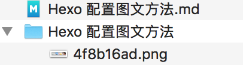

---

title: Hexo 配置图文方法
subtitle: hexosimg
date: 2018-09-18 17:07:58
tags: Other
mathjax: true

---

<!--# Hexo 配置图文方法-->

1. 把主页配置文件`_config.yml`里的`post_asset_folder`这个选项设置为`true`
2. 在终端切换到`hexo目录下`执行命令`npm install hexo-asset-image --save`，这是下载安装一个可以上传本地图片的插件, 插件地址: [GitHub-hexo-asset-image](https://github.com/CodeFalling/hexo-asset-image)
3. 把文章放在在`_post`目录下, 并且新建文件夹并与`.md`的文件名一直
4. 在文章中引用图片使用 ``
5. `hexo g` 生成 html 文件
6. `hexo s` 预览

例如:

测试图片:

